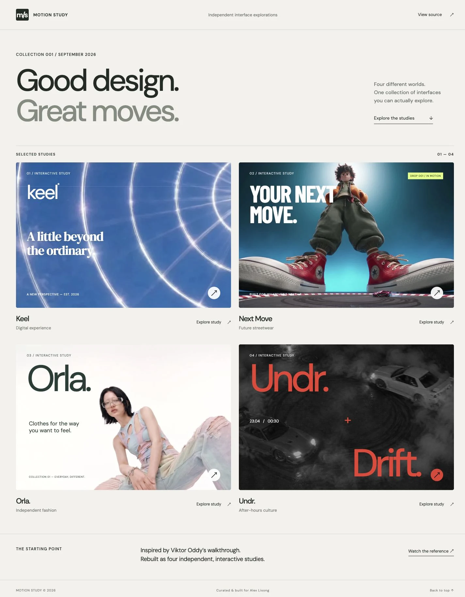

# Motion Study

Four interactive UI studies inspired by [Viktor Oddy’s design walkthrough](https://x.com/viktoroddy/status/2099488750283923775). A browsable gallery, four distinct visual worlds, and working interactions — built with HTML, CSS, and JavaScript.



## Explore

| Study              | Direction                                                 | Interaction                                                          |
| ------------------ | --------------------------------------------------------- | -------------------------------------------------------------------- |
| **01 · Keel**      | Blue skies, chrome imagery, expressive serif type         | Scroll parallax and anchored sections                                |
| **02 · Next Move** | Futuristic streetwear and full-bleed campaign imagery     | Scroll-scrubbed video, size selection, local demo bag                |
| **03 · Orla**      | Quiet fashion editorial, oversized wordmark, open space   | Scroll-scrubbed fashion film and keyboard-accessible collection tabs |
| **04 · Undr**      | After-hours automotive culture, red type, monochrome film | Looping background video and expandable night details                |

## Run locally

Requires Node.js 20 or later. No packages, API keys, or installation are needed.

```sh
git clone https://github.com/AlexLisong/motion-study.git
cd motion-study
npm run dev
```

Open **http://127.0.0.1:4173**. Individual studies are directly addressable:

```text
/?study=keel
/?study=next-move
/?study=orla
/?study=undr
```

`PORT=8080 npm run dev` selects a different local port. `npm run build` validates the authored static files; the complete site already lives in `dist/`. Any static host can serve that directory. Query-string routes work without server rewrites, including under a repository subpath.

## Included

- Responsive gallery and layouts, checked at desktop and phone widths.
- Native modal dialogs with focus restoration, Escape-to-close, size selection, bag totals, and item removal.
- Arrow-key, Home, and End navigation for collection tabs.
- Motion controls and `prefers-reduced-motion` support. Videos are not loaded initially when reduced motion is enabled.
- Local video files, WebP posters, and self-hosted fonts; no runtime CDN requests, analytics, or backend.
- A development server with byte-range support for reliable video seeking.

The store and event pages are fictional concepts. Bag contents are held in memory and reset on page navigation or reload; there is no checkout, payment, or real event registration.

## Source map

```text
dist/
  index.html       Entry point
  app.js           Gallery, four studies, motion and interactions
  styles.css       Shared foundation and study-specific styling
  assets/          Local films, posters, fonts and favicon
scripts/
  serve.mjs        Local static server with video range support
  check.mjs        Entrypoint and asset validation
docs/
  reference.md     Source timestamps, asset credits and adaptations
  verification.md Browser checks and known limits
  screenshots/    Desktop and mobile captures
  licenses/       Font licenses
```

## Credits and reuse

Design inspiration: **Viktor Oddy / MotionSites**. This is an independent study, not an official product or affiliation. The implementation was written for this repository; original site source code was not copied.

The [MIT license](LICENSE) covers the original application code and favicon. **Reference-derived videos, posters, and the artwork appearing in screenshots are excluded from that license** and remain subject to their owners’ rights. The source recording did not establish a general redistribution or commercial-use license for that artwork. See [reference and asset credits](docs/reference.md) before reuse. Fonts retain their included SIL Open Font Licenses.

See [verification notes](docs/verification.md) for the checks performed.
